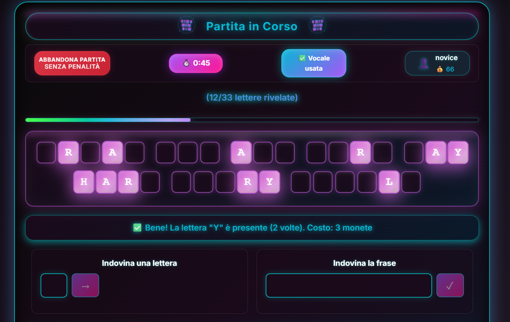
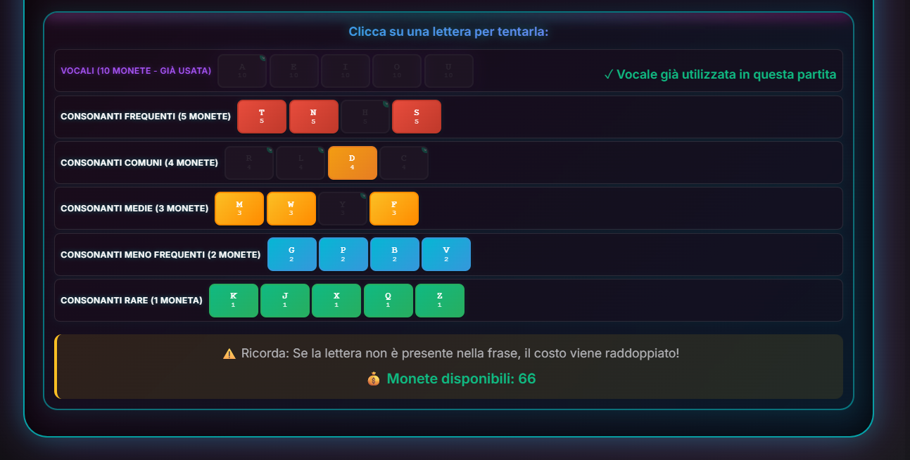

# Esame #3: "Indovina la Frase"
## Student: s345147 NECERINI IVAN 

> 📋 **Documentazione Completa del Progetto**  
> Per informazioni dettagliate sui singoli componenti, consulta i README specifici:
> - 🖥️ **[Server Backend](./server/README.md)** - API, Database, Autenticazione, Validazione
> - ⚛️ **[Client Frontend](./client/README.md)** - React SPA, Components, Routes, Hooks

---

## 📱 Screenshot dell'Applicazione

### Partita in Corso - Modalità Giocatore Autenticato



---

## ⚙️ Installazione e Avvio

### Prerequisiti di Sistema
- **Node.js 22.x** (versione LTS)
- **npm** (incluso con Node.js)
- **nodemon** (per sviluppo): `npm install -g nodemon`

⚠️ **IMPORTANTE**: Se nodemon non è installato globalmente, il comando `nodemon index.mjs` fallirà. In tal caso, usare `npm run dev` dalla directory server.

### Setup Completo del Progetto

1. **Installare le dipendenze per entrambi i componenti:**
   ```bash
   # Server backend
   cd server
   npm install
   
   # Client frontend  
   cd ../client
   npm install
   ```

2. **Inizializzare il database SQLite:**
   ```bash
   cd server
   npm run initdb
   ```

3. **Avviare l'applicazione completa** (2 terminali necessari):
   ```bash
   # Terminal 1 - Avvio Server Backend (porta 3001)
   cd server
   nodemon index.mjs
   
   # Terminal 2 - Avvio Client React (porta 5173)
   cd client
   npm run dev
   ```

4. **Accesso all'applicazione:**
   - **Frontend:** `http://localhost:5173`
   - **API Server:** `http://localhost:3001`

---

## 👤 Credenziali Utenti di Test

Il database viene inizializzato con utenti predefiniti per testing:

| Username | Password | Monete | Descrizione |
|----------|----------|--------|-------------|
| **novice** | NoviceUser123! | 100 | Utente nuovo senza partite giocate |
| **empty** | EmptyCoins456@ | 0 | Utente senza monete per testare limitazioni |
| **player** | PlayerGame789# | 180 | Utente esperto con storico partite |

---

## 🎮 Modalità di Gioco

### 🔐 Modalità Autenticata
- **Costo partita:** 10 monete iniziali
- **Costo lettere:** Consonanti 1 moneta, Vocali 5 monete
- **Premio vittoria:** +100 monete
- **Timer:** 60 secondi per partita
- **Frasi:** Pool dedicato per utenti registrati

### 👤 Modalità Guest (Ospite)
- **Accesso:** Gratuito senza registrazione
- **Costo lettere:** Nessun costo
- **Limitazioni:** Nessun premio in monete
- **Timer:** 60 secondi identico alla modalità auth
- **Frasi:** Pool dedicato (3 frasi specifiche)

---
## 🏗️ Architettura del Sistema

### Pattern "Dual Server" (Separazione Frontend/Backend)

Il progetto adotta un'architettura a **due server separati e indipendenti**:

```
┌─────────────────────────────────────┐
│           CLIENT FRONTEND           │
│         React SPA Vite              │
│       http://localhost:5173         │
├─────────────────────────────────────┤
│ • React 19 + React Router 7         │
│ • Vite dev server (HMR)             │
│ • Component-based UI                │
│ • Custom Hooks per logica           │
│ • CSS modulari per stili            │
│ • Gestione stato locale             │
└─────────────────────────────────────┘
                    │
                    │ HTTP REST API
                    │ fetch() with
                    │ cookie credentials
                    ▼
┌─────────────────────────────────────┐
│           SERVER BACKEND            │
│         Express REST API            │
│       http://localhost:3001         │
├─────────────────────────────────────┤
│ • Node.js 22 + Express 4.18         │
│ • SQLite Database                   │
│ • Passport.js Authentication        │
│ • Express-validator                 │
│ • bcryptjs Password Hashing         │
│ • Cookie-based Sessions             │
│ • CORS configurato                  │
└─────────────────────────────────────┘

• Frontend serve SOLO l'interfaccia utente React
• Backend espone SOLO le API REST per dati e logica business  
• Comunicazione tramite fetch() con credentials per cookie di sessione
• Nessuna commistione: client non conosce database, server non serve HTML
```

### Stack Tecnologico

**Frontend (Client):**
- React 19.1.0 + React Router 7.8.2
- Vite 6.3.5 (build tool e dev server)
- Component-based architecture con Custom Hooks
- Styling modulare con CSS separati

**Backend (Server):**
- Node.js 22.x + Express 4.18.2
- SQLite database con file `.db`
- Passport.js per autenticazione cookie-based
- Express-validator per validazione input
- bcryptjs per hashing password

---

## 📊 Database Schema

### Tabelle Principali
- **`users`** - Utenti, password hash, saldo monete
- **`phrases`** - Frasi del gioco (modalità auth/guest)
- **`games`** - Partite con stato, timer, costi/guadagni
- **`game_letters`** - Tracking lettere tentate per partita

---

## 📁 Struttura Repository

```
esame3-indovina-frase-IvanNece/
├── README.md                    # Overview generale progetto
├── package.json                 # Dipendenze root (se presenti)
├── package-lock.json            # Lock file dipendenze root
├── images/                      # Screenshot applicazione
│   ├── auth1.png
│   └── auth2.png
├── client/                      # Frontend React SPA
│   ├── README.md
│   ├── package.json
│   └── [src, public, config...]
└── server/                      # Backend Express API
    ├── README.md  
    ├── package.json
    └── [api, db, auth, lib...]
```

---

**Progetto realizzato per l'esame di Applicazioni Web I**  
**Politecnico di Torino - A.A. 2024/25**
